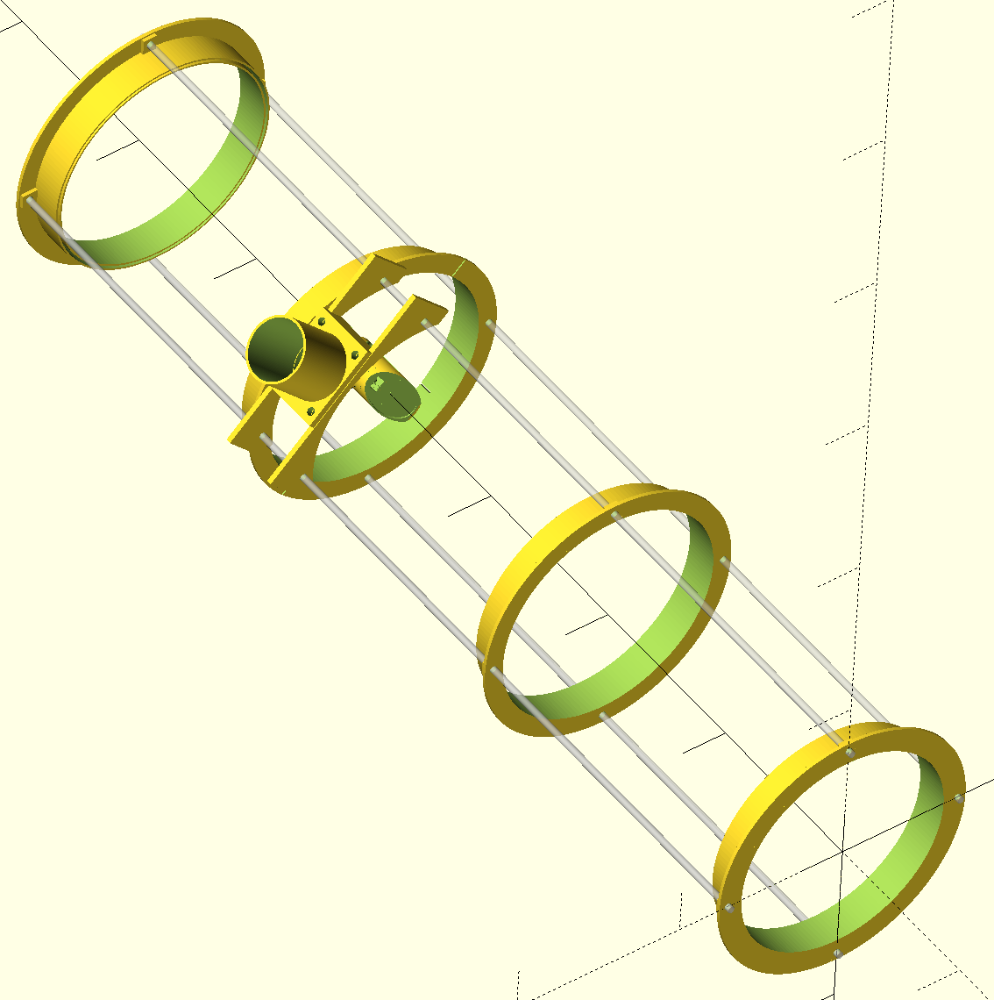
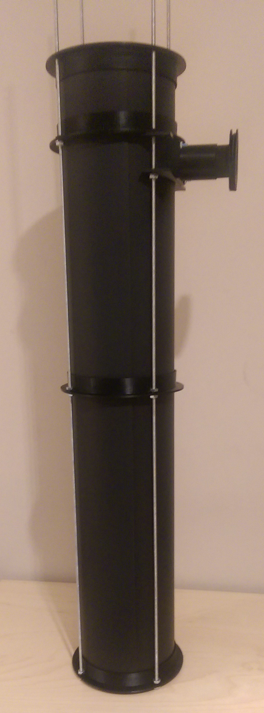
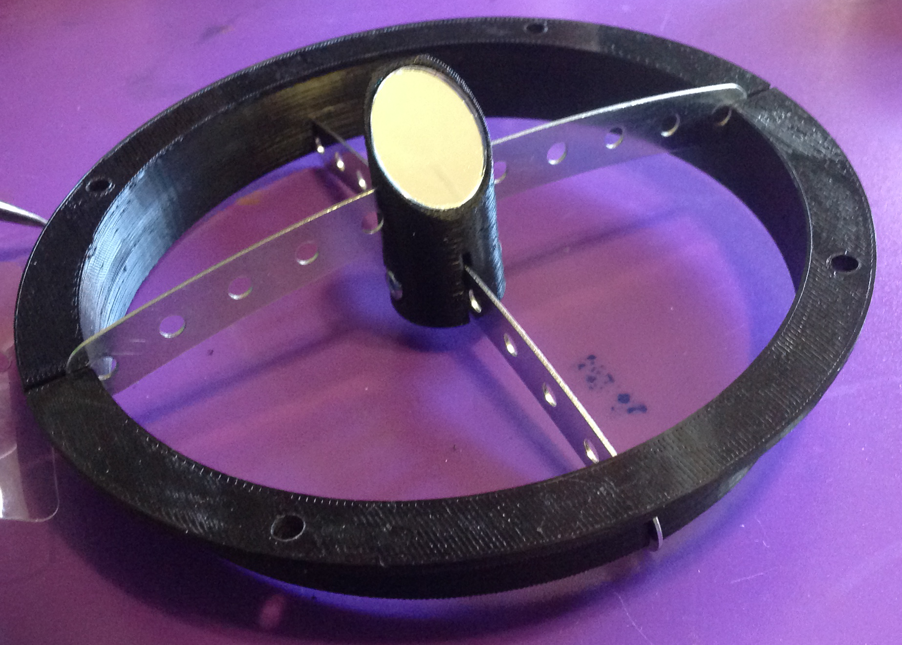

# 3D printable-telescope

This is a simple 3D-printable Newtonian telescope requiring minimal parts.
We constructed ours using the following parts:

 * An old magnifying shaving mirror (note this is not parabolic)
 * A small [oval mirror](https://www.amazon.com/gp/product/B0018N5Q8E) from Amazon.
 * A piece of black posterboard cardstock rolled into a tube
 * Two curved erector set beams, with nuts and bolts
 * #8-32 threaded rod, with nuts and washers
 * [50mm concave lens](https://www.amazon.com/gp/product/B00BIKGMZ8) by Eisco

The top and bottom parts have both an inner and outer ring, and the cardboard
tube fits in the space between these two rings. All other parts use only the
outer ring.

As you can probably imagine, with an off-the-shelf shaving mirror, the optics
are less than ideal (actually it's terrible) but hopefully the same recipe will
work for whatever primary mirror and secondary mirror you are able to obtain.
In most telescopes, the primary mirror is the most sensitive component and the
most costly. You'll need a high-quality parabolic mirror if you want to
actually see anything more than a smudge through the telescope. Once you have
your mirrors, you'll just need to adjust a few parameters to get the prints for
your telescope.

Note that there's nothing in this design to hold the primary mirror against the
tube. It should be easy enough to print something to do this, but exactly what
you need will depend on the shape of your mirror housing. If you have a specific
need then by all means raise an issue and I'll see what I can come up with.

## Configuration and Printing

Here is a picture of the 3D model from [OpenSCAD](http://www.openscad.org):

Here is a picture of the almost-completely assembled telescope

The first step is of course measuring your objective mirror (`base_r1` in the
SCAD file). This determines the size of the tube pieces. Once it is set, you
can print out two of the `tube_base()` and one or more `tube_ring()` to hold
the cardboard cube in place.

You can also at this point print the `eyepiece_tube()` part to hold the
eyepiece assembly onto the threaded rods. The `eyepiece_tube_2()` part extends
the eyepiece tube, and is held on with erector-set nuts and bolts. The size
here is compatible with standard 1.25" eyepieces, and in case it helps I've
included an `lens_extender()` part that allows you to slide an eyepiece in
and out. There's no fancy rack-n-pinion system here - just friction holding it
all in place.

The `lens_tube()` part is a little tricky - in order to be printed in one piece,
it needs to be printed in the same orientation it's used in. However, this needs
support when printing. Unless you have a high-end printer that can print
dissolvable support material, you don't want to enable support as the result
will most likely be a filled-in inner tube that you can't clean up. Instead, I
came up with a minimalist support structure that should be easy to remove but
will provide sufficient support. So use `lens_tube_printable()` to generate
that.

You'll also need to measure your secondary mirror. I've assumed that it's oval
in shape, and the radii are `secondary_r1` and `secondary_r2` in the SCAD file.
The secondary mirror is glued to a mirror mount that holds it steady at 45
degrees. Inserted into the mirror mount are two erector-set / meccano "strip"
beams at 90 degrees from each other. Once you've adjusted the mirror radii
parameters, and ensured that the support beams line up with the notches in
`tube_ring_cut()` you're ready to print that part and the `mirror_mount()` part.
Test that it works and lines up with having the eyepiece assembly below it.
This is what ours looks like:

If you need to adjust the height / width of the notches, or the height of the
secondary mirror mount, go ahead and do whatever works best for you, or raise
an issue and I'll see what I can do. It's probably best to keep the theme of
having one over and one under the supporting ring, and just adjust the bolt/nut
holes in the secondary mirror mount to fit whatever hardware you have available.

When you're done with printing, you should have the following parts (plus of
course the black posterboard):

## Assembly

First we start threading nuts onto the threaded rod. Unless you increase
`base_r5` you'll find that you can't fit a washer on the top side of the rings,
so your parts go on as:

 * top nut
 * ring / other part
 * washer
 * bottom nut

Obviously for the top ring this order is reversed. The best order for threading
is this:

 1. top nuts for ring
 2. ring
 3. washers and bottom nuts for ring
 4. top nuts for base dual-ring
 5. base dual-ring
 6. washers and bottom nuts for base
 7. 2x washers bottom nuts for eyepiece assembly
 8. eyepiece assembly
 9. 2x washers and bottom nuts for notched mirror mount ring
 10. notched ring with mirror mount
 11. top nuts for notched ring
 12. bottom nuts for top dual-ring

At this point, pause and use your secondary mirror to determine the best place
(vertically) for the eyepiece assembly. You should be able to look through the
eyepiece tube, see the secondary mirror in center view, and through it see all
of the inner base ring. We found that the notched ring fit immediately above
the eyepiece assembly, and we rested it on top of that on two of the threaded
rods. Verify that the vertical alignment is correct for your configuration, and
adjust if necessary.

Now remove the two erector-set strip beams (or whatever you're substituting)
that hold the secondary mirror mount in place. Insert the black posterboard,
feeding it down and into the gap between the two rings. Put on the top dual-ring
piece, but you don't need to tighten any nuts at this stage as friction will
hold it in place. You'll need to cut slots into the posterboard to accommodate
your mirror mount, and make a circular hole to allow the eyepiece to actually
see anything. Make sure that everything is level before you start, mark the
position of the holes, and then move the notched ring up and out of the way so
you can start cutting.

Once you've made the cuts, now comes the tricky part - reinsert the mirror mount
supports so that they're held in place by the notched ring and they're locked in
place with the necessary bolts. We first put the lower support beam (closest to
the secondary mirror) and bolted that in place, then glued the secondary
mirror on, and inserted this partially assembled piece into the notches in the
notched ring through the slots in the poasterboard. Then we inserted the second
support beam, getting it in place in the notched ring before bolting it into the
secondary mirror mount.

Now, finally, you can tighten all the nuts to hold everything securely in place.
Hold the primary mirror in place, look through the eyepiece hole (without any
lens) to make sure you can see something, and then try it with a magnifying
eyepiece.

Give yourself a high five - you just made a telescope!
